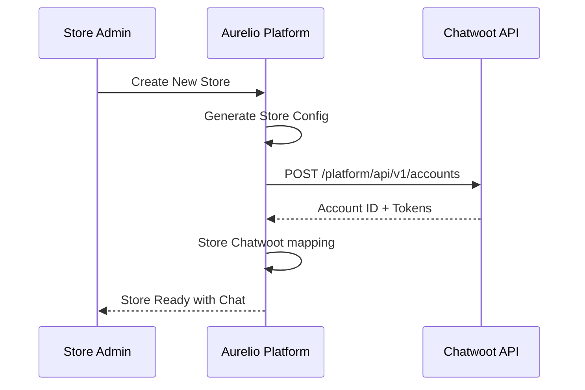
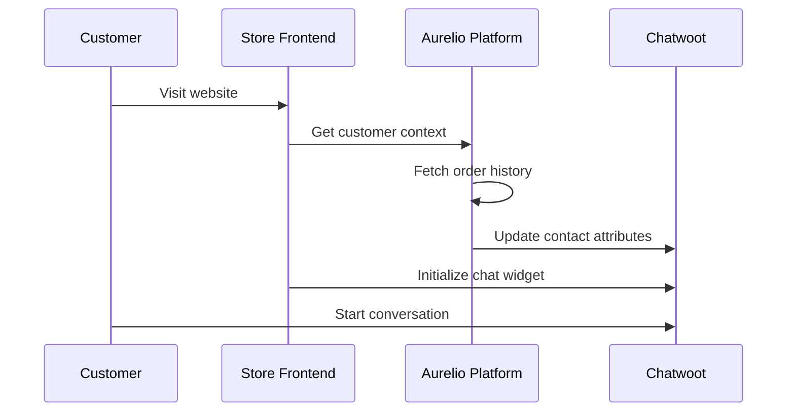
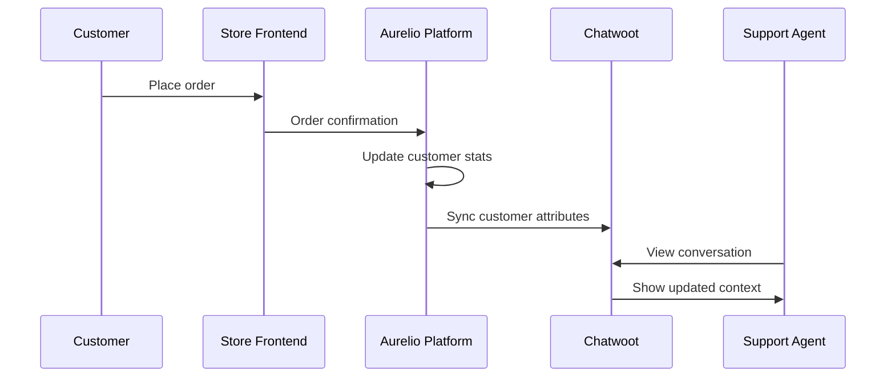

# Chatwoot Multi-Store Architecture Design

## System Overview

```
┌─────────────────┐    ┌──────────────────┐    ┌─────────────────┐
│   Store A       │    │   Aurelio        │    │   Chatwoot      │
│   Frontend      │◄──►│   Platform       │◄──►│   Instance      │
│                 │    │   (Central)      │    │   (Self-hosted) │
└─────────────────┘    └──────────────────┘    └─────────────────┘
┌─────────────────┐              │                       │
│   Store B       │              │                       │
│   Frontend      │◄─────────────┘                       │
└─────────────────┘                                      │
┌─────────────────┐                                      │
│   Store C       │                                      │
│   Frontend      │◄─────────────────────────────────────┘
└─────────────────┘
```

## Core Components

### 1. Centralized Chatwoot Instance
- **URL**: chatwoot.aurelioliving.nl
- **Architecture**: Multi-account setup
- **Accounts**: 1 account per store/organization
- **Agents**: Cross-account access for centralized support

### 2. Aurelio Platform Integration Layer
- **Account Management**: Automated Chatwoot account creation
- **Data Synchronization**: Real-time customer/order sync
- **Widget Management**: Dynamic chat widget injection
- **Context Provider**: Customer order history API

### 3. Store Frontend Integration
- **Chat Widget**: Dynamically configured per store
- **Customer Identification**: Auto-login for logged-in users
- **Branding**: Store-specific styling and messaging

## Data Flow Architecture

### 1. Store Creation → Chatwoot Account


### 2. Customer Interaction → Context Sync


### 3. Order Event → Customer Profile Update


## Database Schema Extensions

### Chatwoot Integration Tables

```sql
-- Store to Chatwoot account mapping
CREATE TABLE public.chatwoot_accounts (
  id uuid PRIMARY KEY DEFAULT gen_random_uuid(),
  organization_id uuid NOT NULL REFERENCES organizations(id),
  chatwoot_account_id integer NOT NULL,
  website_token text NOT NULL,
  api_access_token text NOT NULL,
  account_status text DEFAULT 'active',
  created_at timestamptz DEFAULT now(),
  updated_at timestamptz DEFAULT now(),
  UNIQUE(organization_id),
  UNIQUE(chatwoot_account_id)
);

-- Customer to Chatwoot contact mapping
CREATE TABLE public.chatwoot_contacts (
  id uuid PRIMARY KEY DEFAULT gen_random_uuid(),
  organization_id uuid NOT NULL REFERENCES organizations(id),
  user_id uuid REFERENCES auth.users(id),
  email text,
  chatwoot_contact_id integer NOT NULL,
  chatwoot_account_id integer NOT NULL,
  last_synced_at timestamptz DEFAULT now(),
  created_at timestamptz DEFAULT now(),
  UNIQUE(chatwoot_contact_id, chatwoot_account_id)
);

-- Chat conversation history
CREATE TABLE public.chatwoot_conversations (
  id uuid PRIMARY KEY DEFAULT gen_random_uuid(),
  organization_id uuid NOT NULL REFERENCES organizations(id),
  chatwoot_conversation_id integer NOT NULL,
  chatwoot_contact_id integer NOT NULL,
  status text DEFAULT 'open',
  assignee_id integer,
  created_at timestamptz DEFAULT now(),
  updated_at timestamptz DEFAULT now()
);
```

## API Integration Points

### 1. Chatwoot Platform API
```javascript
// Account creation
POST https://chatwoot.aurelioliving.nl/platform/api/v1/accounts
Headers: {
  'api_access_token': process.env.CHATWOOT_PLATFORM_TOKEN
}
Body: {
  "account_name": "aurelio-living-amsterdam",
  "email": "support@amsterdam.aurelioliving.nl"
}
```

### 2. Chatwoot Application API
```javascript
// Contact synchronization
PUT https://chatwoot.aurelioliving.nl/api/v1/accounts/{account_id}/contacts/{contact_id}
Headers: {
  'api_access_token': account.api_access_token
}
Body: {
  "name": "John Doe",
  "email": "john@example.com",
  "custom_attributes": {
    "order_count": 5,
    "total_spent": "€2,450.00",
    "customer_tier": "Gold",
    "last_order_date": "2024-01-15",
    "preferred_language": "nl"
  }
}
```

### 3. Widget SDK Integration
```javascript
// Dynamic widget configuration
window.chatwootSettings = {
  websiteToken: '{{ store.chatwoot_token }}',
  baseUrl: 'https://chatwoot.aurelioliving.nl',
  locale: '{{ store.language }}',
  type: 'standard',
  launcherTitle: 'Chat met {{ store.name }}'
};

// Customer identification
window.$chatwoot.setUser('{{ user.id }}', {
  name: '{{ user.name }}',
  email: '{{ user.email }}',
  custom_attributes: {
    customer_tier: '{{ user.tier }}',
    total_orders: {{ user.order_count }}
  }
});
```

## Security & Privacy

### 1. Data Protection
- **GDPR Compliance**: Customer data retention policies
- **Data Encryption**: TLS 1.3 for all communications
- **Access Control**: Role-based agent permissions
- **Audit Logging**: Complete conversation history tracking

### 2. Authentication Flow
- **API Tokens**: Separate tokens per store account
- **Widget Security**: Domain-based token validation
- **Agent Access**: SSO integration with platform accounts
- **Customer Privacy**: Opt-in chat history retention

### 3. Infrastructure Security
- **Network**: Private VPC with firewall rules
- **Database**: Encrypted at rest and in transit
- **Backups**: Daily encrypted backups with 30-day retention
- **Monitoring**: Real-time security event alerting

## Scalability Considerations

### 1. Performance Optimization
- **Caching**: Redis for session and conversation data
- **CDN**: Static assets via CloudFlare
- **Database**: Read replicas for analytics queries
- **WebSockets**: Horizontal scaling via Redis pub/sub

### 2. Capacity Planning
- **Current**: 10 stores, 100 agents, 10k conversations/month
- **6 months**: 50 stores, 200 agents, 50k conversations/month
- **12 months**: 100 stores, 500 agents, 200k conversations/month

### 3. Monitoring & Alerting
- **Uptime**: 99.9% SLA with automated failover
- **Response Time**: <200ms API response average
- **Error Rate**: <0.1% error rate threshold
- **Resource Usage**: CPU/Memory alerts at 80% utilization